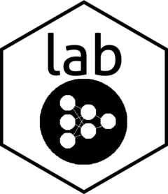

<!-- README.md is generated from README.Rmd. Please edit that file -->

# lab 

<!-- badges: start -->

<!-- badges: end -->

The goal of lab is to provide useful functionality for experimenting
with the development of machine learning and articifical intelligence
related algorithms.

## Installation

You can install the released version of lab from
[CRAN](https://CRAN.R-project.org) with:

``` r
# install.packages("lab") coming soon!
```

And the development version from [GitHub](https://github.com/) with:

``` r
# install.packages("devtools")
devtools::install_github("mtnman38/lab")
```

## Example

This is a basic example which shows you how to solve a common problem:

``` r
library(lab)
## basic example code
```
